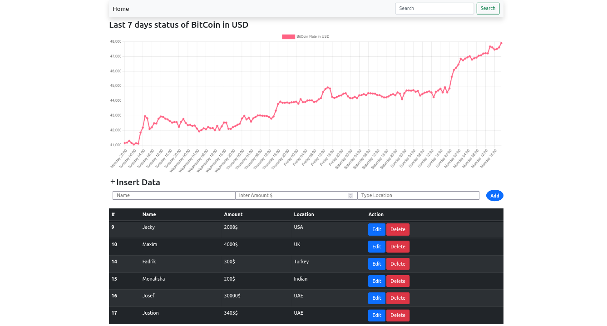

# django-simple-task
this is a simple task with python django api and javascript chart.
xss attact has been prevented from attackers.

To run this project.. 
1.first clone this. 
git clone https://github.com/babuljack/django-simple-task.git  
2.install requirements. 
pip install -r requirements.txt  
3.change the settings. 
change the settings in database name ,user and password according to your mysql database.
Everything should be working fine. 
Thanks..

# Overview

